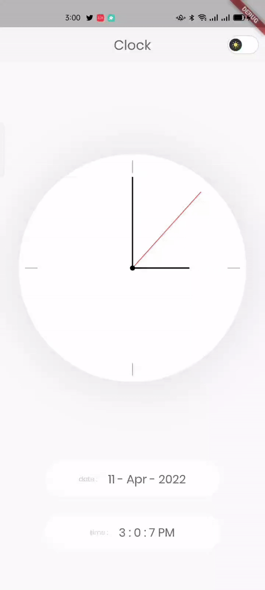
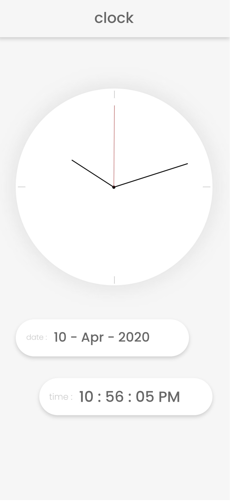
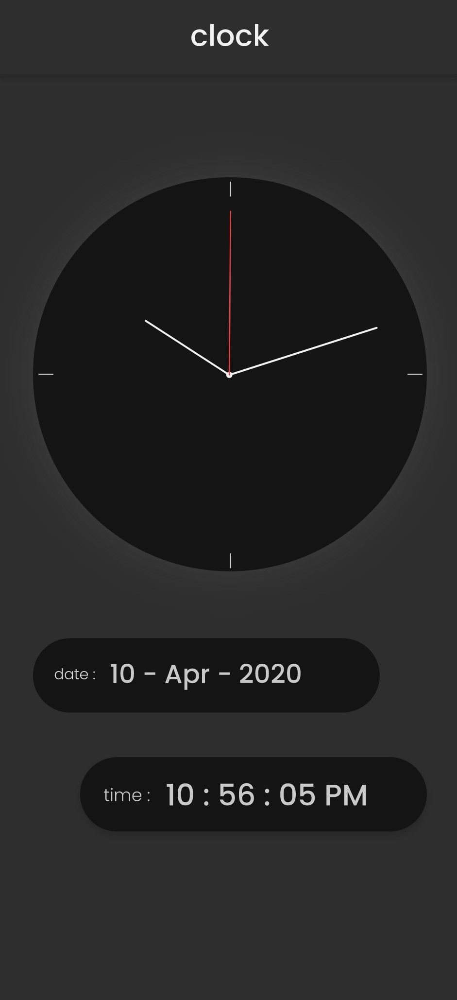

#  Clock App ✍🏻
Clock App with GetX  👨🏻‍💻

Clock App app is open-source  app for Android & ios. It is built with Dart on top of Google's Flutter Framework.

<b>ClocK App </b>

## About🤠

Clock App with GetX and GetStorage To Store Data  and CustomPainter

## Benfit👻
- [🖥] # Screens 🖥
- [🆗] Clock Screen Dark Mode
- [🆗] Clock Screen Dark Light

--------------------------------
- [x] MVC patterns
-------------------------------
- [🖥] # Deal With 🖥
- [x] Deal With GetX
- [x] Deal With GetStorage
- [x] Deal With CustomPainter

------------------------------

## Snapshots

| Light Screen
|------
|

| Dark Screen
|------
|
